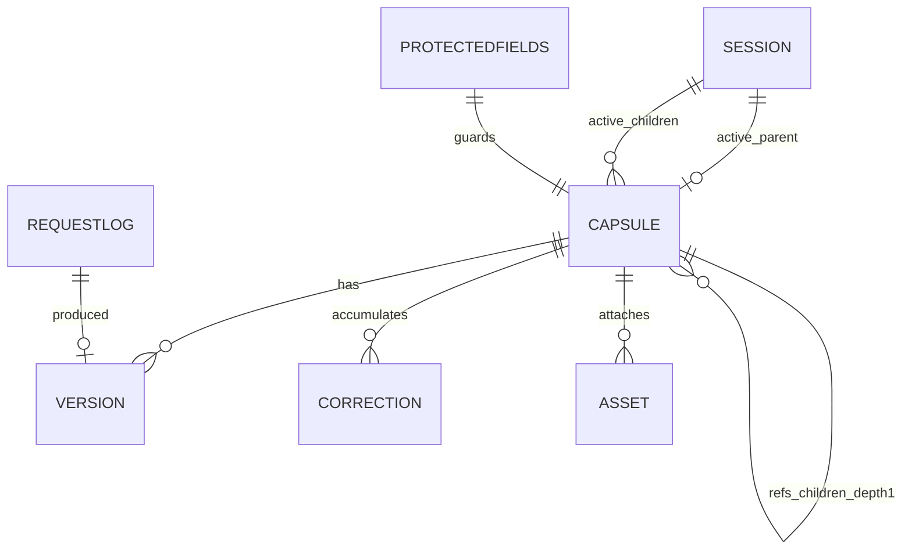

# U1 Domain Entities — Server & Store & Contracts

> 기술 중립 도메인 모델. 타입은 개념 표기(구현 시 pydantic/dataclass 매핑, Python 3.10–3.11).
> 근거: `component-methods.md`, `contract-decisions.md`(D-01..D-07), `u1-functional-design-plan.md` 확정답 Q1..Q10=A.
> ⚠️ "캡슐 정상화(Normalization)" = SPEC "compaction". Claude Code context compaction과 **무관**.

---

## 1. Capsule (집합체 루트 / Aggregate Root)

Capsule은 하나의 skill을 나타내는 단일 진실원. 인메모리 저장, 재시작 비영속(Q9 요건).

| 필드 | 타입 | 설명 | 불변성/규칙 |
|---|---|---|---|
| `skill_id` | str | 전역 고유 식별자 | 등록 후 **불변**(protected, I-14). 중복 등록 차단 키(I-06). |
| `name` | str | 표시 이름(인덱스 노출) | 변경은 protected-change(I-14). |
| `description` | str | 인덱스 노출 설명(훅 주입 대상) | 변경은 콘텐츠 변경 → 새 version. |
| `version` | int | 현재 확정본 번호 | **단조 증가 정수**(Q1=A). 등록=1, 콘텐츠 변경마다 +1. 한번 부여된 version 콘텐츠는 불변(I-01). |
| `body` | str | 단일 마크다운 텍스트(SKILL.md 본문) | 길이 ≤ L(=10,000, Q6=A). 정상화 병합 대상(Q2=A). |
| `corrections` | Correction[] | 누적 교정 목록(미병합) | 순서 보존(seq). count==3 → normalize_due(Q7=A). 정상화 커밋 시 병합분 제거. |
| `refs_children` | str[] | 직속 자식 skill_id 목록(depth-1) | I-15: 자식은 다시 자식을 가질 수 없음(손자 금지). |
| `assets` | Asset[] | 첨부 자산 메타 목록 | 정상화 시 집합 보존(I-11). temp-dir 격리(§5). |
| `protected_fields` | str[] | 보호 필드명 고정 집합 | Q9=A: `{skill_id, name, refs_children, protected_fields}`. 그 자체가 보호됨. |
| `created_at` | timestamp | 등록 시각 | 불변. |
| `updated_at` | timestamp | 최신 version 시각 | 콘텐츠 변경마다 갱신. |

**용어 주의**: 로드 시 소비자에게 보이는 "렌더 결과"는 `body` + 확장된 depth-1 자식 `body` + 유효 `corrections`를 합성한 것이며, 저장된 `body` 자체가 아니다(Q2=A).

**Capsule 생애주기(콘텐츠 version 관점)**:
```
register        → v1 (corrections=[])
apply_nag       → v2, v3, v4 ... (매 교정마다 +1, corrections 누적)
                  corrections.count==3 도달 시 normalize_due=true
commit_normalization → v(N+1) (병합 body, 병합분 corrections 제거)
protected-change→ v(N+1) (승인 + freshness 통과 시)
```

---

## 2. Version (값 객체)

version은 Capsule 콘텐츠의 확정 스냅샷 식별자.

| 필드 | 타입 | 설명 |
|---|---|---|
| `number` | int | 단조 증가 정수(Q1=A) |
| `body_snapshot` | str | 해당 version의 body(불변, I-01) |
| `request_id` | str | 이 version을 만든 요청의 멱등 키 |
| `origin` | enum | `register` \| `nag` \| `normalize` \| `protected_change` |
| `created_at` | timestamp | 생성 시각 |

- **불변식 I-01**: 부여된 `number`의 `body_snapshot`은 절대 재작성되지 않는다. 변경은 항상 새 `number`.
- **I-04(stale)**: 쓰기 요청의 `base_version`이 현재 `version`과 다르면 거부(STALE_BASE_VERSION).
- v1 데모: 히스토리 전체 보관은 선택(메모리). 최소 요건은 latest 확정본 + stale 판정을 위한 현재 `version` 값 유지. (Code Generation에서 히스토리 보관 폭 결정)

---

## 3. Correction (값 객체) — Q3=A

잔소리(교정) 1건. 아직 body에 병합되지 않은 상태로 누적.

| 필드 | 타입 | 설명 | 규칙 |
|---|---|---|---|
| `id` | str | correction 고유 id | 순서 식별 |
| `target` | str (skill_id) | 교정 대상(parent 또는 로드된 child) | I-13: resolve_target이 판정. |
| `instruction_text` | str | 교정 지시 텍스트 | 길이 ≤ L 개별 검사(Q6=A). |
| `request_id` | str | 멱등 키 | I-05: 동일 request_id 재수신 시 미추가. |
| `seq` | int | 누적 순서(1..) | 유효 지시 합집합 병합 시 순서 근거. |
| `created_at` | timestamp | 생성 시각 | |

- **count 규칙(Q7=A)**: Capsule의 미병합 `corrections` 개수가 **정확히 3**에 도달하면 `normalize_due=true`. `normalize_in_progress` 중에도 추가 correction은 정상 누적된다(콘텐츠 계속 변경, I-10).
- **병합(정상화)**: `corrections`를 `seq` 순으로 유효 지시 합집합으로 병합해 새 `body` 구성(서브에이전트가 수행, U3). 서버는 결과를 구조적으로 검증만(Q8=A).

---

## 4. RefsGraph (관계) — I-15, D-06

Capsule 간 저장 관계(depth-1).

| 개념 | 규칙 |
|---|---|
| parent → children | `refs_children`에 직속 자식 skill_id 목록(depth-1). |
| **depth ≤ 1 (I-15)** | 자식으로 등록/연결되는 Capsule이 자체 `refs_children`을 가지면 **손자 발생 → 거부(DEPTH_LIMIT)**. "읽기 시 손자 생략"으로 대체 불가. |
| 적용 시점 | **신규 등록 AND refs 변경 둘 다**에서 검사(I-15). |
| 위반 응답 | `DEPTH_LIMIT` + 위반 경로 + 권고(자식 분리/평탄화), **상태 무변경**. |
| depth-1 정확 경계 | 정확히 1단계는 허용(DEV-46). |
| 확장(load 시) | parent 로드 시 직속 자식의 `body`+`corrections`를 확장 합성(I-03, D-06). 부모·자식 모두 교정 대상. |

**텍스트 관계도**:
```
parent (refs_children=[c1, c2])
  ├─ c1  (refs_children=[]  ← 반드시 비어야 함)
  └─ c2  (refs_children=[]  ← 반드시 비어야 함)
c1이 refs_children=[g1] 을 가지면: parent-c1 연결 또는 c1 등록이 손자 g1 유발 → DEPTH_LIMIT
```

---

## 5. ProtectedFields (정책) — Q9=A, I-14

- **고정 집합**: `{ skill_id, name, refs_children, protected_fields }`.
- 일반 `apply_nag`는 `body`/`corrections`만 변경 가능.
- 위 보호 필드 변경은 `protected-change` 경로로만: **승인 플래그(approval) + base_version freshness(I-04)** 둘 다 충족해야 함. 미충족 시 `PROTECTED_CHANGE_DENIED`.
- `protected_fields` 목록 자체도 보호 대상(임의 축소로 우회 불가).

---

## 6. RequestLog (멱등 기록) — Q10=A, I-05

| 필드 | 타입 | 설명 |
|---|---|---|
| `request_id` | str (UUID) | 전역 멱등 키 |
| `outcome_ref` | ref | 해당 요청이 만든 결과(skill_id + version) 참조 |
| `recorded_at` | timestamp | 최초 처리 시각 |

- **범위**: 전역(register/nag/normalize/protected-change 공통).
- **재수신**: 동일 `request_id` → 새 version/correction **미추가**, **직전 결과(대상 Capsule 최신 확정본) 반환**(오류 아님).
- **미제공**: `request_id` 없는 쓰기 요청은 검증 오류(SERVER_ERROR 계열이 아닌 입력 검증 오류로 거부).

---

## 7. Session (세션 상태) — D-01, I-02/I-10

서버측 세션 레코드가 활성 범위·진행 상태의 단일 진실원. 인메모리, 비영속.

| 필드 | 타입 | 설명 | 규칙 |
|---|---|---|---|
| `session_id` | str | 세션 식별자(플러그인이 전달) | "새 작업 = 새 세션". |
| `active_parent` | {skill_id, version} | 활성 parent + 로드된 version | I-02: 실제 로드한 version 기록. |
| `active_children` | {skill_id, version}[] | 활성 직속 자식 + version | I-02. |
| `progress_flags` | map | `normalize_due`, `normalize_in_progress` 등 | **콘텐츠와 분리**(I-10: 플래그 변경은 content 바이트 불변). |

- 한 세션은 하나의 parent + 직속 children을 활성화(§4B).
- 진행 플래그는 skill 레코드/세션에 보관되어 context compaction으로 모델 기억이 지워져도 다음 상호작용에서 재관측 가능(트리거 유실 방지, D-01/contract-decisions §3).

---

## 8. Asset (값 객체) — §5, D-06

| 필드 | 타입 | 설명 |
|---|---|---|
| `name` | str | 자산 이름 |
| `path` | Path | temp-dir 내부 경로(격리) |
| `is_script` | bool | 스크립트 여부 |

- 쓰기 경로는 지정 temp 디렉터리 내부로 격리(path-traversal 차단, §5 / `contain_path`).
- 스크립트 자산은 **자동 실행 금지**; 요약 후 명시 동의 필요(`guard_script` → ScriptNotice).
- 정상화 시 assets 집합 보존(I-11, Q8=A 검증 대상).

---

## 9. 엔티티 관계도 (ERD)

### Mermaid (검증됨: node id 영숫자, 특수문자 없음)


### 텍스트 대안 (항상 포함)
```
CAPSULE (aggregate root)
  1 --- * VERSION        (콘텐츠 스냅샷, 불변 I-01)
  1 --- * CORRECTION     (미병합 교정, count==3 -> normalize_due)
  1 --- * ASSET          (temp-dir 격리)
  1 --- * CAPSULE        (refs_children, depth<=1, I-15 손자 금지)
  1 --- 1 PROTECTEDFIELDS(고정 집합 정책)
SESSION
  1 --- 1 CAPSULE        (active_parent + version, I-02)
  1 --- * CAPSULE        (active_children + version, I-02)
  progress_flags        (normalize_due/in_progress, 콘텐츠와 분리 I-10)
REQUESTLOG
  1 --- 1 VERSION        (멱등: request_id -> 결과, I-05)
```

---

## 불변식 → 엔티티 매핑 요약

| 불변식 | 관련 엔티티/필드 |
|---|---|
| I-01 불변 version | Version.body_snapshot, Capsule.version(+1) |
| I-02 로드 기록 | Session.active_parent/children(+version) |
| I-03 부모+자식 교정 전달 | RefsGraph 확장, Correction.target |
| I-04 stale 거부 | Version.number vs base_version |
| I-05 멱등 | RequestLog, Correction.request_id, Version.request_id |
| I-06 중복 등록 차단 | Capsule.skill_id 완전일치(Q4=A) |
| I-09 과길이 거부·보존 | Capsule.body / Correction.instruction_text ≤ L(Q6=A) |
| I-10 진행상태≠콘텐츠 | Session.progress_flags 분리 |
| I-11 정상화 보존 | assets/refs 집합 + corrections 추적(Q8=A) |
| I-12 원자성 | Version+포인터+RequestLog 한 단위 커밋 |
| I-13 대상 판정 | Correction.target / resolve_target |
| I-14 보호 필드 | ProtectedFields 고정 집합(Q9=A) |
| I-15 depth-1 | RefsGraph 손자 금지 |
