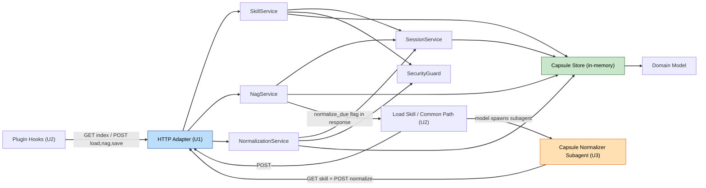

# Component Dependencies — Jansori Plugin

> 의존성 매트릭스·통신 패턴·데이터 흐름. 통신: 플러그인↔서버 = loopback HTTP; 서버 내부 = 함수 호출(Layered).

## 의존성 매트릭스 (행 → 열 의존)
| ↓의존 \ 대상→ | Adapter | SkillSvc | NagSvc | NormSvc | SessionSvc | SecGuard | Store | Domain |
|---|---|---|---|---|---|---|---|---|
| HTTP Adapter | — | ✔ | ✔ | ✔ | ✔ | ✔ | — | — |
| SkillService | — | — | — | — | ✔ | ✔ | ✔ | ✔ |
| NagService | — | — | — | — | ✔ | — | ✔ | ✔ |
| NormalizationService | — | — | — | — | ✔ | ✔ | ✔ | ✔ |
| SessionService | — | — | — | — | — | — | ✔ | ✔ |
| SecurityGuard | — | — | — | — | — | — | — | ✔ |
| Store | — | — | — | — | — | — | — | ✔ |

- 계층 규칙: 상위(Adapter/Service) → 하위(Domain/Store) 단방향. 역방향 의존 없음.
- Plugin(U2)·Capsule Normalizer Subagent(U3) → 서버는 **loopback HTTP만**. 서버는 클라이언트를 역호출하지 않음(정상화는 클라이언트가 트리거·제출, Q7=B).

## 통신 패턴
| 경로 | 프로토콜 | 비고 |
|---|---|---|
| Plugin Hooks → 서버 인덱스 | HTTP GET (2000ms 상한) | fail-open(I-08), LLM 없음 |
| Load Skill / Common Path → 서버 | HTTP POST | 공통 액션 경로 |
| Capsule Normalizer Subagent → 서버 | HTTP GET /skills/{id} + POST /skills/{id}/normalize | Capsule만 취득·병합·제출; base_version 검증·원자 커밋 |
| 서버 → 클라이언트 | 응답 페이로드만 | `normalize_due` 등 플래그 전달(푸시 아님) |
| 서버 내부 | in-process 함수 호출 | Layered |

## 데이터 흐름 (개념)



### Text Alternative
```
U2 Plugin Hooks / Load Skill / Common Path --loopback HTTP--> U1 HTTP Adapter
U3 Capsule Normalizer Subagent --GET /skills/{id} + POST /skills/{id}/normalize--> U1 HTTP Adapter
HTTP Adapter --calls--> SkillService / NagService / NormalizationService
  each Service --uses--> SessionService, SecurityGuard, Capsule Store
  Capsule Store --holds--> Domain Model (Capsule/Version/Correction/RefsGraph/ProtectedFields)
NagService --normalize_due flag in response--> 메인 모델(Load Skill/Common Path) --spawns background subagent--> Capsule Normalizer Subagent
서버는 클라이언트를 역호출하지 않음(플래그는 응답으로만 전달). 정상화 트리거는 훅이 아니라 모델(검증 반영); 서브에이전트는 GET으로 Capsule 취득 후 POST /skills/{id}/normalize. (우리 캡슐 정상화 ≠ Claude Code context compaction)
```

## 결합·경계 노트
- Store는 유일한 상태 소유자(단일 진실원). 서비스는 Store를 통해서만 상태 접근.
- SecurityGuard는 파일 쓰기/바인딩 경로에 횡단 적용, 서비스가 명시 호출.
- 정상화(SPEC: compaction) 트리거/실행은 클라이언트(U2/U3)에 있고 검증·커밋만 서버(U1) — 서버 단순성 유지(Q7=B). Claude Code context compaction과 무관.
