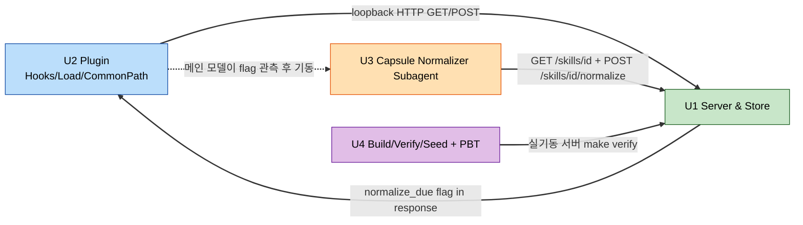

# Unit of Work Dependency — Jansori Plugin

> 단위 간 의존성·통합 계약·구현 순서. 근거: `component-dependency.md`, `contract-decisions.md`(D-01..D-07), `unit-of-work-plan.md`(Q2=A, Q4=A).
> ⚠️ "정상화(Normalization)" = SPEC "compaction". Claude Code context compaction과 무관.

## 단위 의존성 매트릭스 (행 → 열 의존)

| ↓의존 \ 대상→ | U1 Server | U2 Plugin | U3 Normalizer | U4 Harness |
|---|---|---|---|---|
| **U1 Server** | — | — | — | — |
| **U2 Plugin** | ✔ (loopback HTTP) | — | ✔* (트리거) | — |
| **U3 Normalizer** | ✔ (GET Capsule + POST /normalize) | — | — | — |
| **U4 Harness** | ✔ (실기동 서버 대상 `make verify`) | ✔ (플러그인 계약 검사) | — | — |

- `*` U2→U3: **직접 코드 의존 아님**. 메인 모델이 응답의 `normalize_due` 플래그를 관측하고 U3 서브에이전트를 기동(load Skill/`/jansori:nag` 지시). 훅이 서브에이전트를 직접 호출하지 않음.
- **U1은 어떤 단위에도 의존하지 않음**(단일 진실원, 클라이언트 무의존). 서버는 클라이언트를 역호출하지 않음 — `normalize_due`는 응답 페이로드 플래그일 뿐(푸시 아님).
- **순환 없음**: U4→U2, U2→U3 엣지가 있어 전부가 U1로 *직접* 수렴하진 않으나(간접 수렴), 위상 정렬 U1→U3→U2→U4가 성립하므로 비순환.

## 통신 패턴

| 경로 | 프로토콜 | 계약 근거 | 비고 |
|---|---|---|---|
| U2 Hooks → U1 인덱스 | HTTP GET `/skills/index` (2000ms 상한) | D-05 | fail-open(I-08), LLM 없음 |
| U2 Load/Common Path → U1 | HTTP POST (`/load`,`/register`,`/nag`,`/protected-change`) | D-02, D-03, D-04 | 자연어/`/jansori`/load 공통 경로; 오류·상한(2000ms, L=10,000, request_id 멱등) = D-03 |
| U3 Normalizer → U1 | HTTP GET `/skills/{id}` + POST `/skills/{id}/normalize` | D-07, D-06 | Capsule만 취득·병합·제출; base_version 검증·원자 커밋(U1) |
| U1 → 클라이언트 | 응답 페이로드만 | D-01 | `normalize_due` 등 플래그 전달(푸시 아님) |
| U4 → U1 | 프로세스 기동 + HTTP | — | in-test 실서버 기동/종료, 기계 계약 검사 |

## 통합 계약 (contract-first, Q4=A)

- **단일 진실원**: §8 계약 결정 **D-01..D-07**(`contract-decisions.md`)이 단위 간 인터페이스의 유일 기준. 엔드포인트·요청/응답 스키마·오류 코드·상한(L=10,000, 2000ms)·멱등(request_id)·원자성 규칙 포함.
- **검증 원칙**: U4 `make verify`가 **실제 기동 U1 서버**를 대상으로 기계 계약을 검사. **가짜/모의 Store 통과는 검증으로 인정하지 않음**(가드레일, US-17 AC1).
- **U2↔U1, U3↔U1** 통합은 위 D-계약 준수로 성립 — 별도 stub 경로는 두지 않음(Q4=A: 실기동 서버 대상 검증).

## 구현(빌드) 순서 (Q2=A)

```
U1 (Server & Store & Contracts)
   → U2 (Claude Code Plugin)
      → U3 (Capsule Normalizer Subagent)
         → U4 (Build/Verify/Seed + PBT)
```

- **근거**: U1이 계약·엔드포인트·저장소를 확정해야 U2/U3가 실제 엔드포인트에 결합. U4는 완성된 U1 서버를 실기동해 `make verify`·PBT·3상태 transcript를 실행하므로 마지막.
- per-unit 루프: 각 단위를 Functional Design→Code Generation으로 완결 후 다음 단위로. Build and Test는 전 단위 완료 후 1회(전 단위 대상).

## 데이터 흐름 (개념)



### Text Alternative
```
U2 Plugin --loopback HTTP GET/POST--> U1 Server & Store (single source of truth)
U3 Capsule Normalizer Subagent --GET /skills/{id} + POST /skills/{id}/normalize--> U1
U4 Harness --live-server make verify--> U1
U1 --normalize_due flag in response payload--> U2 (no push, no reverse call)
U2: 메인 모델이 normalize_due 관측 후 U3 서브에이전트 기동(코드 의존 아님, 모델 트리거)
순환 없음: 모든 의존이 U1로 수렴. U1은 클라이언트 무의존.
(정상화 = SPEC compaction ≠ Claude Code context compaction)
```
