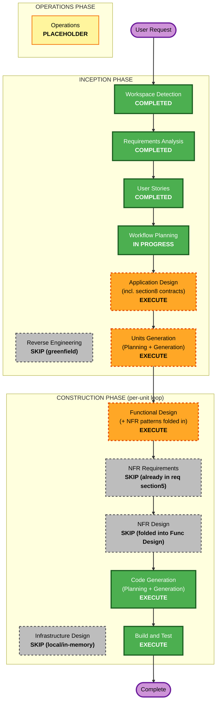

# Execution Plan — Jansori Plugin

> 근거: `requirements/requirements.md`, `user-stories/stories.md`, `user-stories/personas.md`, `aidlc-state.md`. SPEC.md가 최종 진실원. §4B 재개방·불변식 약화 없음.

## Detailed Analysis Summary

### Transformation Scope
- **Project Type**: Greenfield (신규 Jansori 제품). Brownfield 아님 — 저장소의 C++ 워크로드/시드/골든/`verify_sample.py`는 **제공 입력(요구·평가 도구)**이며 역공학 대상이 아님.
- **Primary Changes**: 로컬 loopback 전용 Python 서버 + Claude Code 플러그인으로 교정-전파 루프 구현. 핵심 차별화 = compaction(임계값 3, subagent, 보존-또는-무변경).

### Change Impact Assessment
- **User-facing changes**: Yes — 3 페르소나(P1 교정자 / P2 다음-세션 소비자 / P3 운영·검증자)의 실제 워크플로우(발견·로드·잔소리·전파 증명).
- **Structural changes**: Yes — 신규 다중 컴포넌트 시스템(플러그인 훅 + load Skill + save/nag + 서버 + 인메모리 저장소 + refs 확장 + compaction subagent).
- **Data model changes**: Yes — Capsule JSON 스키마(단일 진실원), version/corrections 구조, refs 그래프(depth ≤ 1), 진행 상태(콘텐츠와 분리).
- **API changes**: Yes — §8 D-01..D-07 계약(공통 세션 상태, action/API 매핑, 오류·한계, 데이터·쓰기 원자성, 플러그인 실행, refs 확장, compaction 실행)을 팀이 제안하고 게이트에서 승인(Q11=A).
- **NFR impact**: Yes — §5 보안 경계(loopback-only, temp-dir 격리, 스크립트 무자동실행, 소스·프롬프트 무수집), 신뢰성/한계(fail-open, 길이 한계 L, 원자적 쓰기), 속성 기반 테스트(Hypothesis, PBT-01..10).

### Risk Assessment
- **Risk Level**: High — 경성 불변식 I-01..I-15(특히 I-15 저장 관계 depth-1 양방향, I-12 원자성, I-11 compaction 보존), 다중 세션 전파 증명, 증거 정직성(F-03..F-07)이 수용 조건.
- **Rollback Complexity**: Easy — 인메모리 저장소·재시작 비영속(Q9=B); `make run`은 빈 상태로 시작, `make seed`가 매 실행 채움. 코드 롤백은 git 단위.
- **Testing Complexity**: Complex — `make verify`(실제 기동 서버 기계 계약) + 실제 3상태 C0/C1/C2 transcript(전파 증거, expected+actual) + PBT 스위트(불변식·멱등·stateful·oracle) 병행.

## Workflow Visualization

### Mermaid Diagram



### Text Alternative (always included)

```
INCEPTION PHASE
- Workspace Detection ......... COMPLETED
- Reverse Engineering ......... SKIP (greenfield product)
- Requirements Analysis ....... COMPLETED (approved)
- User Stories ................ COMPLETED (approved)
- Workflow Planning ........... IN PROGRESS (this stage)
- Application Design .......... EXECUTE (new components + section8 contract-decisions gate)
- Units Generation ............ EXECUTE (multi-component decomposition)

CONSTRUCTION PHASE (per-unit loop, each unit design+code before next)
- Functional Design ........... EXECUTE (Capsule schema, versioning/compaction/refs logic + NFR patterns folded in)
- NFR Requirements ............ SKIP (already documented in requirements.md section5; tech stack decided Q6-10; limit values decided in App Design section8)
- NFR Design .................. SKIP (patterns folded into Functional Design; enforced in Build and Test)
- Infrastructure Design ....... SKIP (local loopback + in-memory; no cloud; Makefile in code-gen)
- Code Generation ............. EXECUTE (always)
- Build and Test .............. EXECUTE (always)

OPERATIONS PHASE
- Operations .................. PLACEHOLDER
```

## Phases to Execute

### INCEPTION PHASE
- [x] Workspace Detection (COMPLETED)
- [x] Reverse Engineering (SKIPPED — greenfield; fixtures are provided inputs, not product source)
- [x] Requirements Analysis (COMPLETED — approved 2026-09-08T02:00:00Z)
- [x] User Stories (COMPLETED — approved 2026-09-08T03:00:00Z)
- [x] Execution Plan (IN PROGRESS)
- [ ] Application Design — **EXECUTE**
  - **Rationale**: 신규 다중 컴포넌트(서버·플러그인·저장소·compaction subagent)의 메서드·비즈니스 규칙·의존성 정의 필요. 또한 §8 D-01..D-07 계약 결정(Q11=A) 게이트가 이 단계에서 이뤄지며 코드 전 승인 대상.
- [ ] Units Generation — **EXECUTE**
  - **Rationale**: 시스템이 명확히 다중 작업 단위로 분해됨(서버/저장소·플러그인 훅·load Skill·save/nag·compaction subagent·build/verify/seed+PBT 하네스). 구조화된 분해로 per-unit 루프를 구동.

### CONSTRUCTION PHASE (per-unit)
- [ ] Functional Design — **EXECUTE** (+ NFR 패턴 흡수)
  - **Rationale**: 신규 데이터 모델(Capsule JSON, corrections, refs 그래프)과 복잡 비즈니스 로직(불변 버전 상승, 임계값·base_version 판정, compaction 병합, 보호 필드 승인)의 상세 설계 필요.
  - **NFR 이관(구속 조건)**: 스킵된 NFR Design의 패턴을 여기서 명시 — loopback 바인딩, temp-dir 경로 격리(path-traversal), 원자적 인메모리 쓰기(I-12), compaction 보존/무변경(I-11), fail-open 타임아웃(I-08), Hypothesis PBT 제너레이터·stateful·oracle 설계(PBT-01..10). 이는 선택이 아니라 수용 조건.
- [ ] NFR Requirements — **SKIP** (사용자 승인 2026-09-08)
  - **Rationale**: NFR 요구가 이미 `requirements.md §5.1/5.2/5.3`에 상세 문서화됨(중복). Tech stack은 Q6~Q10에서 결정됨. 미결 한계값(fail-open 상한, 길이 L)은 §8 D-03로 **Application Design §8 계약 게이트에서 결정**(Q11=A). **이관 필수 조건**: §5 보안·§5.2 신뢰성·§5.3 PBT는 MANDATORY로 유지되며 Functional Design/Code Generation/Build and Test의 수용 조건으로 강제됨(스킵은 게이트만 제거, 요건은 불변).
- [ ] NFR Design — **SKIP** (사용자 승인 2026-09-08)
  - **Rationale**: 로컬·인메모리·무클라우드 범위에서 NFR 패턴이 소규모라 Functional Design에 흡수 가능. **이관 필수 조건**: loopback/temp-dir 격리/원자적 쓰기/fail-open/Hypothesis 하네스 패턴을 Functional Design에서 설계하고 Build and Test에서 강제. PBT(확장 ON full)는 드롭하지 않음.
- [ ] Infrastructure Design — **SKIP (권장)**
  - **Rationale**: 로컬 loopback 전용 + 인메모리·재시작 비영속(Q9=B). 클라우드 리소스·배포 아키텍처·네트워킹 없음. 로컬 실행(`make run`/`make seed`/`make verify`)과 프로세스 구성은 Code Generation에서 다룸. *사용자는 이 단계를 포함하도록 요청할 수 있음.*
- [ ] Code Generation — **EXECUTE (ALWAYS)**
  - **Rationale**: 구현 계획 + 코드·테스트 생성. Part 1(계획) → Part 2(생성) 2단계.
- [ ] Build and Test — **EXECUTE (ALWAYS)**
  - **Rationale**: `make verify`(실제 서버 기계 계약) + 단위/통합/PBT + 3상태 C0/C1/C2 전파 transcript 지시 생성.

### OPERATIONS PHASE
- [ ] Operations — PLACEHOLDER
  - **Rationale**: 향후 배포·모니터링 워크플로우용 자리표시자.

## Likely Unit Decomposition (확정은 Units Generation 단계)
1. **Server & Store & Contracts** — loopback FastAPI/Flask, 인메모리 Capsule 저장소, §8 D-01..D-07 계약, 원자적 쓰기(I-12), 멱등 재시도(I-05), 길이 한계·거부(I-09), 보호 필드 승인(I-14), refs depth-1(I-15).
2. **Claude Code Plugin** — UserPromptSubmit 인덱스 주입(I-08 fail-open), Stop 저장 제안(notice only), `load` Skill(refs 확장 I-03), `/jansori:save`·`/jansori:nag` 공통 처리 경로.
3. **Compaction Subagent** — 임계값 3 트리거, 백그라운드 subagent, 보존-또는-무변경(I-10/I-11), 새 version+body 후 corrections 비움.
4. **Build/Verify/Seed + PBT Harness** — 제네릭 `make seed`(하드코딩 ID 없음, DEV-38), `make verify`(in-test 실 서버), Hypothesis PBT-01..10 + golden 예제 테스트.

*주의: 위는 계획 지침이며, 실제 단위 경계·개수는 Units Generation에서 확정.*

## Deliverables & Ownership (SPEC §12, 재확인)
- **Team**: README, `make run`/`make verify`/제네릭 `make seed`, 도메인·실행 증거(golden-data / demo-scenario / demo-transcript), 이해도 점검 실행·기록.
- **User**: 데모 비디오, HTML **또는** PPT 설명 (팀은 설명 콘텐츠·데모 스크립트 제공). 이 산출물들은 축소 없이 필수로 유지되며, 팀 측에서 완료로 표기하지 않음.

## Estimated Timeline
- **Total Stages to Execute**: 5 (INCEPTION 2 남음: Application Design, Units Generation + CONSTRUCTION per-unit: Functional Design, Code Generation + Build and Test 1)
- **Stages Skipped**: 4 (Reverse Engineering, NFR Requirements, NFR Design, Infrastructure Design) — NFR 두 단계는 사용자 승인(2026-09-08)으로 스킵하되 §5/신뢰성/PBT를 Functional Design·Code Generation·Build and Test에 구속 조건으로 이관
- **Estimated Duration**: 복잡도 High — 단위별 반복 설계+코드 게이트 다수. 정확한 소요는 단위 수 확정(Units Generation) 후 산정.

## Success Criteria
- **Primary Goal**: 한 사람의 잔소리 → 동일 `skill_id` 새 version → 다음 새 세션의 **실제 코드 변화** 전파를 증명(단순 저장·주입이 아님), 기존 유효 지시 보존.
- **Key Deliverables**: 로컬 loopback 서버 + Claude Code 플러그인, compaction subagent, `make run/verify/seed`, PBT 스위트, 3상태 C0/C1/C2 transcript, README, 설명·데모 콘텐츠.
- **Quality Gates**:
  - 불변식 I-01..I-15 전부 설계·테스트로 보존(특히 I-15 저장 관계 depth-1 양방향, I-12 원자성, I-11 compaction 보존).
  - §5 보안 경계 강제(loopback-only, temp-dir 격리, 스크립트 무자동실행, 소스·프롬프트 무수집).
  - `make verify`가 실제 기동 서버 대상 기계 계약 통과(가짜 Store 통과 ≠ 검증).
  - 증거 정직성 F-03..F-07: 미수행 항목은 unverified/failed/unimplemented/approved-exclusion으로 정직 표기.
  - §8 계약(D-01..D-07)이 Application Design 게이트에서 사용자 승인 후 코드 진입.
